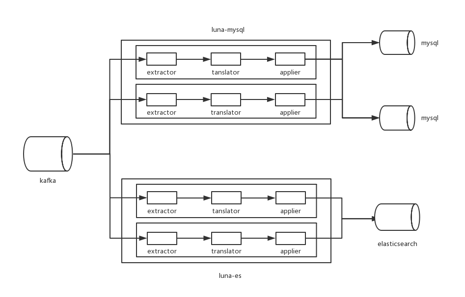

# 介绍

一种基于Binlog实现的MySQL到Elasticsearch增量同步方案：通过Maxwell从Binlog解析mysql增量消息（DML: insert update delete），以Kafka作为消息队列中间件，将数据增量同步到ES的方案。对比定时脚本作业有以下几个优点：

 - 低延时性
批次作业同步带来的高延时性往往很多业务不能接受，基于增量同步的方案大大降低了延时性，也极大的增强了稳定性。
 - 良好的扩展性
利用Kafka这个优秀的分布式消息队列中间件，支持多个生产源生产数据，多个消费端消费数据。可以很方便的扩展生产端（比如添加新的数据库），Kafka集群也可以便捷的扩展以提高容积吞吐，同时消费客户端类luna也可以扩展，以增加订阅等。
 - 组件间解耦，数据冗余，提高可恢复性
组件间充分解耦，即使Maxwell，Kafka，客户端，ES中的任何一部分异常宕机，重启可以保证消息不丢失，可继续工作。
 - 峰值处理能力
峰值并不是工作的常态，可能大多数情况下mysql有更新就可以及时的消费掉，当峰值到来时，应当感知到并且提高消费能力，如果能力依然不够，Kafka提供了消息积压的能力（理论上Kafka几乎可以无限积压消息，虽然可能很少这么做），峰值过后可以尽快消化掉积压。

# 架构

# Maxwell

QuickStart : [http://maxwells-daemon.io/]  
Github : [https://github.com/zendesk/maxwell]

## Download

    curl -sLo - https://github.com/zendesk/maxwell/releases/download/v1.10.6/maxwell-1.10.6.tar.gz | tar zxvf -
    mv maxwell-1.10.6 /home/maxwell
    cd maxwell
    
## Row based replication

    $ vi my.cnf
    [mysqld]
    server-id=1
    log-bin=master
    binlog_format=row

## Mysql permissions

    mysql> GRANT ALL on maxwell.* to 'maxwell'@'%' identified by 'XXXXXX';
    mysql> GRANT SELECT, REPLICATION CLIENT, REPLICATION SLAVE on *.* to 'maxwell'@'%';

    # or for running maxwell locally:

    mysql> GRANT SELECT, REPLICATION CLIENT, REPLICATION SLAVE on *.* to 'maxwell'@'localhost' identified by 'XXXXXX';
    mysql> GRANT ALL on maxwell.* to 'maxwell'@'localhost';

## Config.properties

Copy config.properties.example to config.properties and modify the following properties

    producer=kafka
    log_level=INFO
    output_ddl=false
    output_nulls=false
    kafka.bootstrap.servers=k_host0:9092,k_host1:9092,k_host2:9092,k_host3:9092,k_host4:9092
    kafka_topic=%{database}_%{table} # One table in one topic
    kafka.batch.size=16384
    kafka.compression.type=snappy
    kafka.metadata.fetch.timeout.ms=5000
    kafka.retries=5
    kafka.acks=1 # default 1 get and ack;0 send and ack;all or -1 replica in ISR get ack
    kafka.request.timeout.ms=10000
    kafka.linger.ms=0
    producer_partition_by=table # [database, table, primary_key, column]
    include_dbs=db1,db2
    include_tables=table1,table2,table3

## Start maxwell

    nohup bin/maxwell --user='maxwell' --password='XXXXXX' --host='127.0.0.1' >/etc/null 2>&1 &
    
# Kafka

QuickStart : [https://kafka.apache.org/quickstart]  
Github : [https://github.com/apache/kafka]

## download

It's better to download kafka_2.12-0.11.0.0 and newer version. Unzip and move to work dir

## zookeeper.properties

Modify every zookeeper node

    dataDir=/tmp/zookeeper
    clientPort=2181
    initLimit=5
    syncLimit=2
    server.0=z_host0:2888:3888
    server.1=z_host1:2888:3888
    server.2=z_host2:2888:3888
    server.3=z_host3:2888:3888
	
## server.properties

Modify every broker server.properties

    broker.id=0 # Every broker has unique id(1,2,3,4...).  
    delete.topic.enable=true    
    auto.create.topics.enable=false
    listeners=PLAINTEXT://host:9092 # host is your broker host 
    advertised.listeners=PLAINTEXT://host:9092 # host is your broker host
    log.dirs=/tmp/kafka-logs
    num.partitions=3
    offsets.topic.replication.factor=3
    transaction.state.log.replication.factor=3
    transaction.state.log.min.isr=3
    zookeeper.connect=z_host0:2181,z_host1:2181,z_host2:2181,z_host3:2181 #z_host0 is your zookeeper host
    fetch.purgatory.purge.interval.requests: 100 # Avoid purgatory OOME 
    producer.purgatory.purge.interval.requests: 100

## Some work

Create kafka data dir and zookeeper data dir

    mkdir /tmp/kafka-logs
    chmod 755 -R /tmp/kafka-logs
    mkdir /tmp/zookeeper
    chmod 755 -R /tmp/zookeeper
    
Modify firewall (Your OS may be different and you can close it)
    
    vim /etc/sysconfig/iptables
    
    ## add the following
    -A INPUT -m state --state NEW -m tcp -p tcp --dport 2181 -j ACCEPT
    -A INPUT -m state --state NEW -m tcp -p tcp --dport 2888 -j ACCEPT
    -A INPUT -m state --state NEW -m tcp -p tcp --dport 3888 -j ACCEPT
    -A INPUT -m state --state NEW -m tcp -p tcp --dport 9092 -j ACCEPT
    ## save and quit
    
    service iptables restart

## Start zookeeper cluster

    bin/zookeeper-server-start.sh -daemon config/zookeeper.properties

## Start kafka cluster

    bin/kafka-server-start.sh -daemon config/server.properties
    
# Elasticsearch

I think you should have your elasticsearch cluster. If not, learn and make one.

# luna

## Download And Install

    git clone https://github.com/sanguinar/luna
    cd luna
    mvn package # or not

## Config 

 ### conf/example.yml (Don't modify the indentation)
 
     NewKafka:
      topics:
        - table1_schemal1
        - table2_schemal2
     bootstrap.servers: xx.xx.xx.xx:9092,xx.xx.xx.xx:9092,xx.xx.xx.xx:9092
     group.id: test_group  #modify it
     max.fetch.byte: 1048576
     max.poll.records: 10000
     retry.times: 3
     retry.interval: 1000 #ms 
     purge.interval: 1 #minute/ the interval of restarting the dead consumer-thread  

    Elasticsearch:
      hosts:
        - xx.xx.xx.xx
        - xx.xx.xx.xx
      sniff: true
      compress: false
      cluster.name: application # default elasticsearch
      bulk.border: 10 # which number to use es bulk 
      
### kafka_client_jass.conf 

Kafka 使用SASL_PLAINTEXT权限模块：[Authentication using SASL]

    KafkaClient {
      org.apache.kafka.common.security.plain.PlainLoginModule required
      username="user"
      password="password";
    };

### DingDing.yml (如果没有，注释掉src/main/java/luna/util/DingDingMsgUtil.java 的sendMsg方法的内容)

    url: https://oapi.dingtalk.com/robot/send?access_token=xxxxx
    isAtAll: false
    phonenumbers:
      - "xxxxxxxxxxx" 

## Start luna

    bin/luna-es-start.sh conf/example.yml
    or
    bin/luna-es-start.sh -daemon conf/example

## Log

You can find log file in /data/luna

--------------------------------------------------------
[http://maxwells-daemon.io/]:http://maxwells-daemon.io/ "QuickStart"
[https://github.com/zendesk/maxwell]:https://github.com/zendesk/maxwell "Github"
[https://kafka.apache.org/quickstart]:https://kafka.apache.org/quickstart "QuickStart"
[https://github.com/apache/kafka]:https://github.com/apache/kafka "Github"
[Authentication using SASL]:https://docs.confluent.io/current/kafka/sasl.html "Authentication using SASL"
